# TSNN
This repository contains the testing code of [A Deep Learning Solution for Height Estimation on
a Forested Area based on Pol-TomoSAR data](https://ieeexplore.ieee.org/abstract/document/10121647)., a FCN-based solution for height estimation of forested areas.

If you find this information helpful and choose to incorporate it into your research, please include the following citation:
> W. Yang, S. Vitale, H. Aghababaei, G. Ferraioli, V. Pascazio and G. Schirinzi, "A Deep Learning Solution for Height Estimation on a Forested Area Based on Pol-TomoSAR Data," in IEEE Transactions on Geoscience and Remote Sensing, vol. 61, pp. 1-14, 2023, Art no. 5208214, doi: 10.1109/TGRS.2023.3274395.

TSNN consists of several lays of FCN and the concept of using an FCN-based network for height estimation is from [TSNN for the urban](https://ieeexplore.ieee.org/abstract/document/8900616). 

 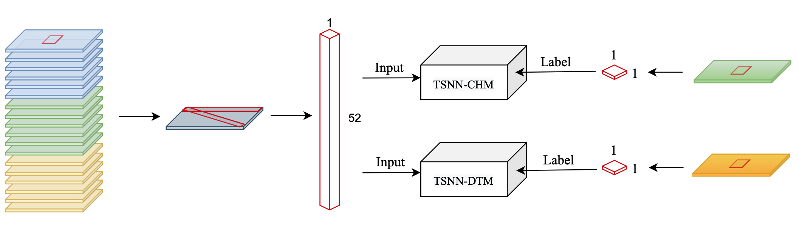

TSNN consists of nine fully connected layers with 400 neurons for the first eight layers while for the last one whose number of neurons matches the number of considered classes. All the layers, but the last, are followed by the [Rectified Linear Unit (ReLU)](https://proceedings.neurips.cc/paper/2012/hash/c399862d3b9d6b76c8436e924a68c45b-Abstract.html) activation function that ensures a stable training procedure and fast convergence.

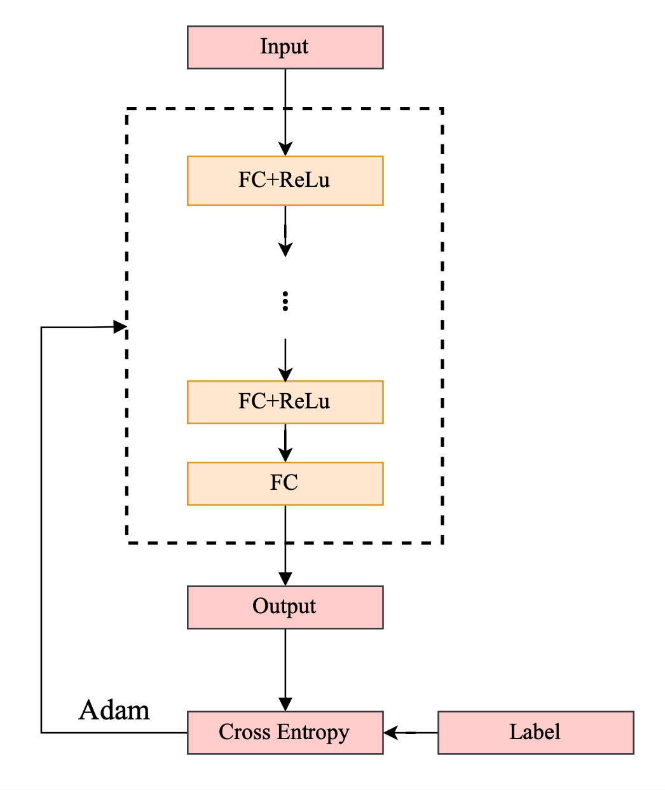 

The cost function is the multiclass cross-entropy function (CE).

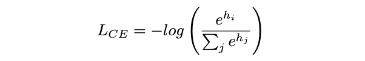 

The test results are shown below:

**Forest**:

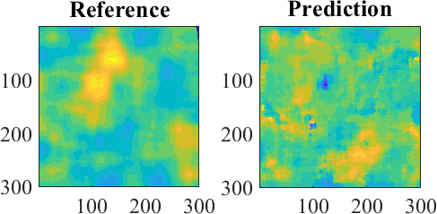 

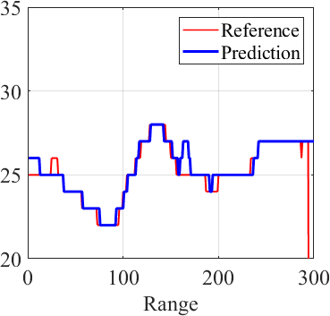 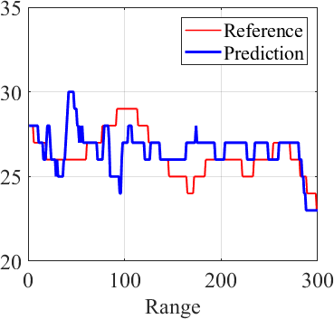  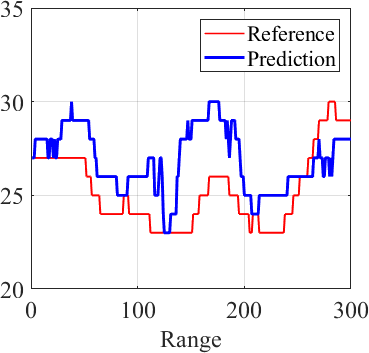

**Ground**:

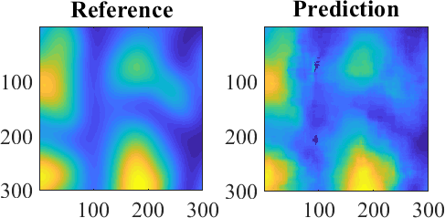 

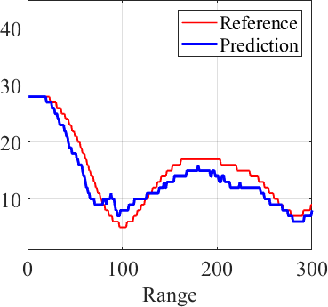 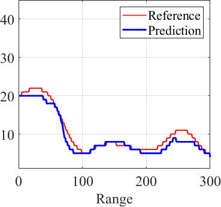  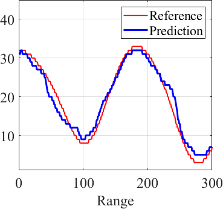

 

# Team members
 Wenyu Yang (wenyu.yang001@studenti.uniparthenope.it); \
 Sergio Vitale (sergio.vitale@uniparthenope.it);\
 Hossein Aghababaei (h.aghababaei@utwente.nl);\
 Giampaolo Ferraioli (giampaolo.ferraioli@uniparthenope.it);\
 Vito Pascazio (vito.pascazio@uniparthenope.it);\
 Gilda  Schirinzi (gilda.schirinzi@uniparthenope.it)

 
# License (how to get it ? for Sergio)
Copyright (c) 2022 Dipartimento di Ingegneria and Dipartimento di Scienze e Tecnologie of Università degli Studi di Napoli "Parthenope".

All rights reserved. This work should only be used for nonprofit purposes.

By downloading and/or using any of these files, you implicitly agree to all the
terms of the license, as specified in the document LICENSE.txt
(included in this directory)

# Usage 
* **data** folder contains two patches: patch1 is for the forest height prediction and patch2 is for the ground height prediction (corresponding to the examples of the paper);
  patch1:
     * *CHM_patch1_x_nc.npy* : the input samples without phase calibration
     * *CHM_patch1_y_step1.npy*: the forest height reference with quantized step, 1m
  patch2:
     * *DTM_patch2_x_nc.npy* : the input samples without phase calibration
     * *DTM_patch2_y_step1.npy*: the ground height reference with quantized step, 1m

* *CHM_9layer_400_0.0001_nc_para.pth* contains trained weights of the forest height prediction
* *DTM_9layer_400_0.0001_nc_para.pth* contains trained weights of the ground height prediction
* *TSNN_cov_models_CHM.py* contains the model implementation of the forest height prediction
* *TSNN_cov_models_DTM.py* contains the model implementation of the ground height prediction
* *TSNN_cov_result_CHM.py* is the main script for testing to predict the forest heights
* *TSNN_cov_result_DTM.py* is the main script for testing to predict the ground heights

# Prerequisites
This code is written on the Ubuntu system for Python 3.7 and uses the Pytorch library.

For correct usage of the code, please install the Python environment with the following steps:

**Installing Anaconda** (if not already installed)

1. download anaconda3 from https://www.anaconda.com/products/individual#linux
2. from the command line, move to the download directory and install the package by:
> sh <Anaconda_downloaded_version>.sh 
and follow the instructions for installation
3. add conda to path
> PATH=~/anaconda3/bin:$PATH

**Installing the conda environment**

The file ./TSNNenv.yml contains the environment for testing the code. You can easily install it by command line:

1. move to the folder containing the GitHub repository and open the terminal
2. run the following command
 > conda env create -f TSNNenv.yml

Once the environment has been set up, activate it by command line as well:

1. activate the environment from the command line

> conda activate TSNNenv

2. Launch Spyder

> spyder

3. goes to the folder containing **TSNN_cov_result_CHM.py** or **TSNN_cov_result_DTM.py**, edit, and run

**Showing results**

1. If you want to visualize the results in Matlab, please run **showresult.m** in **result** folder 

2. The test results in **result** folder are obtained in Matlab R2023a

**TropiSAR Data**

The data for training and testing is gotten by TropiSAR 2009, more details please refer to [TropiSAR](https://earth.esa.int/eogateway/campaigns/tropisar).
